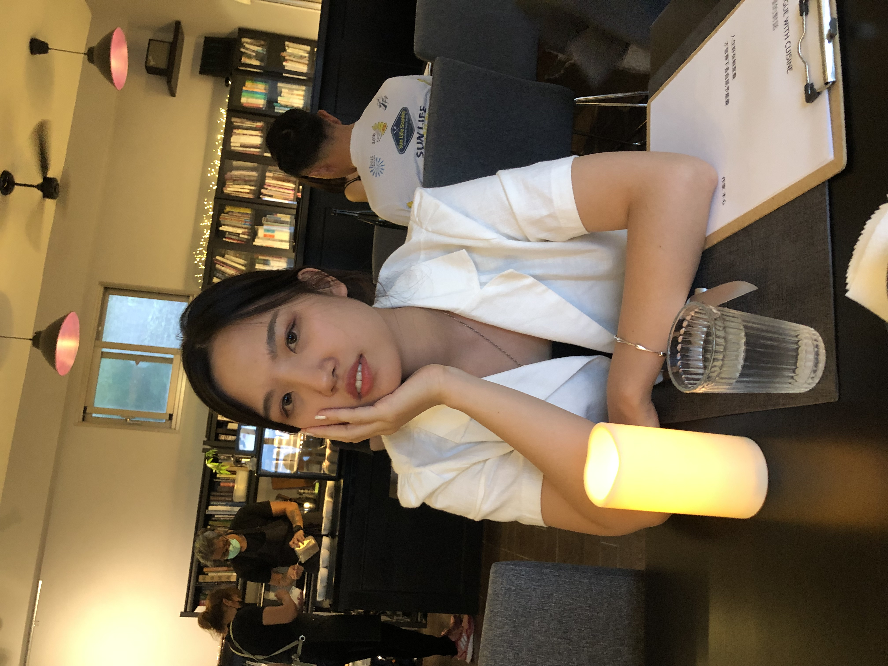

<!DOCTYPE html>
<html>
<head>
	<meta charset="utf-8">
	<meta name="viewport" content="width=device-width, initial-scale=1">
	<title>personal website</title>
	
</head>
<body>
	
	<table border ="1" style = "width: 90%;"
		
			<thead>
				<tr>
					<th colspan="3"> <h1 id="myHeader">Profile</h1>
					</th>
				</tr>
			
			</thead>

			<tbody>
				<tr>
					<td rowspan="3">	
						  
						 
						personal photo  
					</td><
					<td colspan="2">
						
						 <li>Name: Winnie Huang</li>
					 	 
					 	<li>Gender: female </li>
					 	 
					 	<li>birth day: 2001/12/06 </li>
					</td>
				</tr>
			</tbody>

	</table>
	<h2 class="topic">Introduction</h2>
	
Hi I am Winnie. I am studying in Chenchi University and major in MIS.
	I love playing piano and guitar. Wanna know more about me? follow my social media accounts. 

	

</body>
</html>
